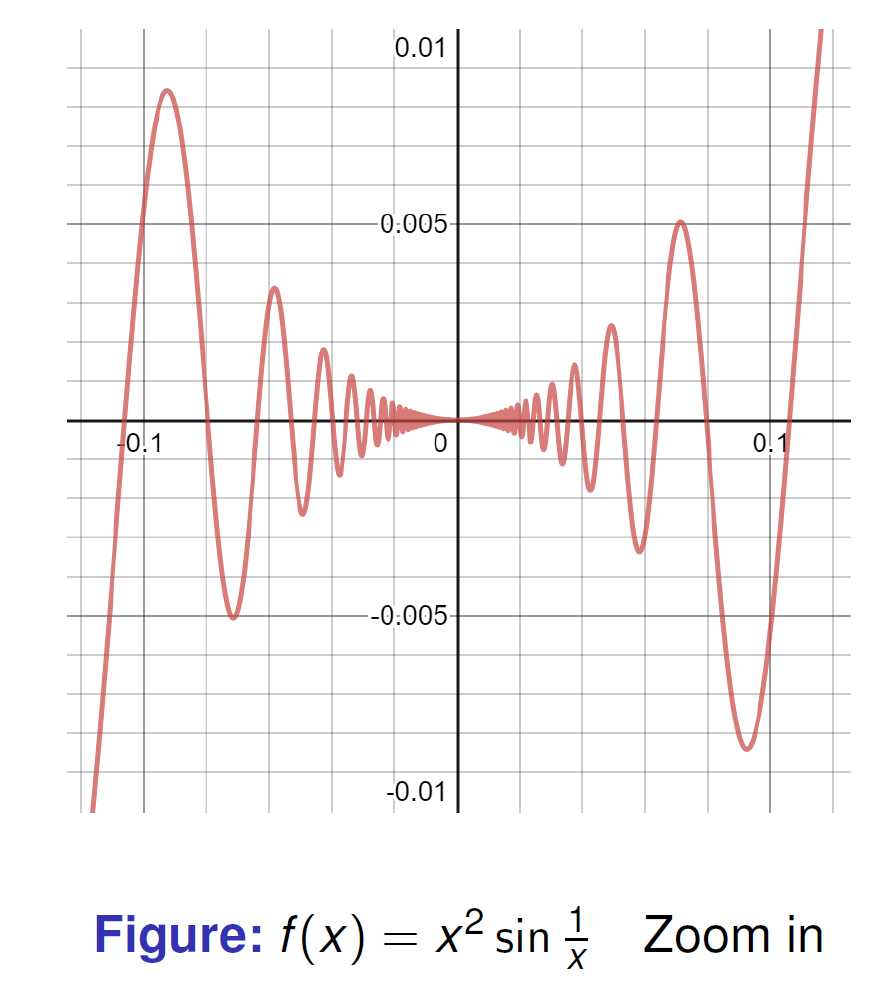
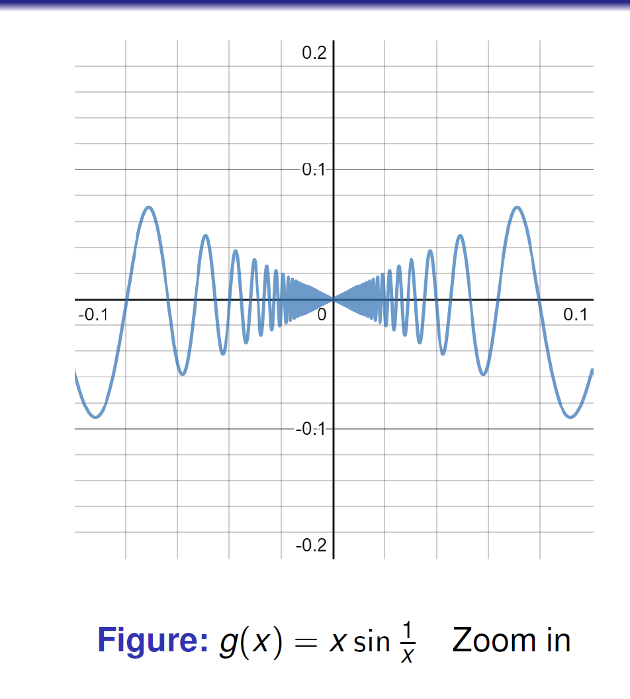
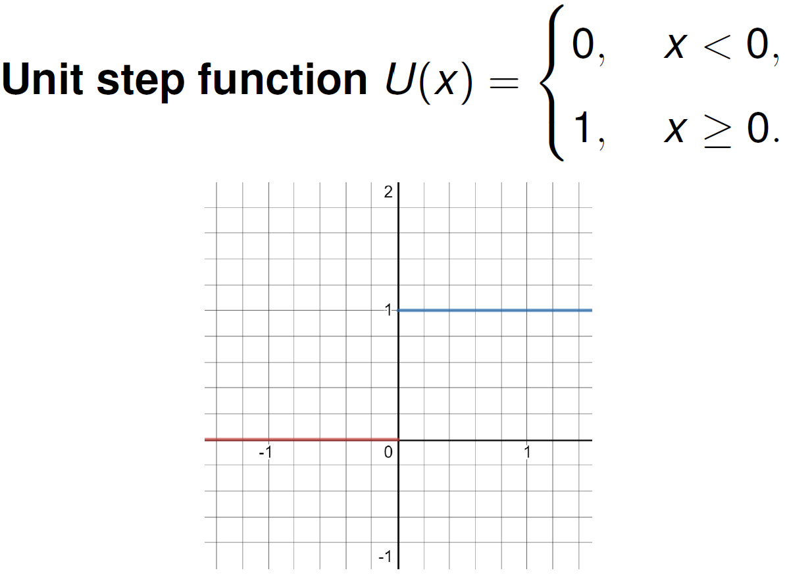
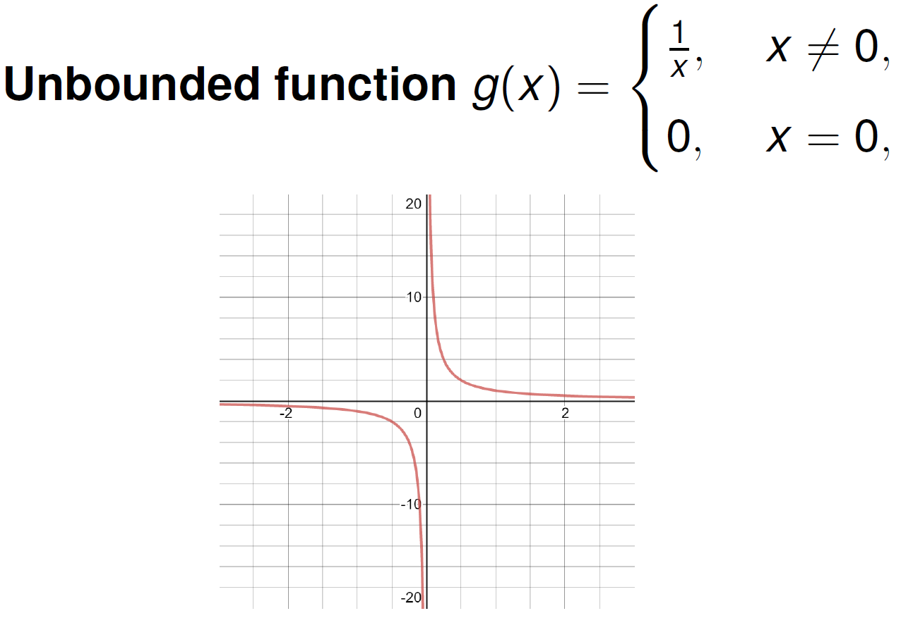
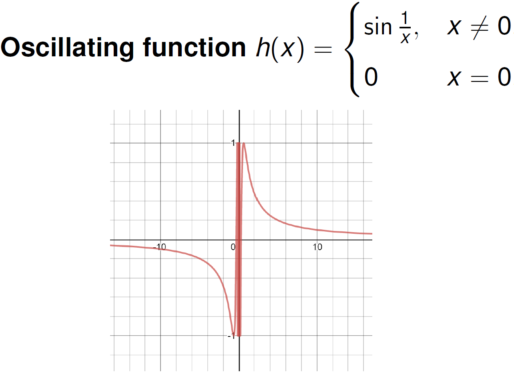
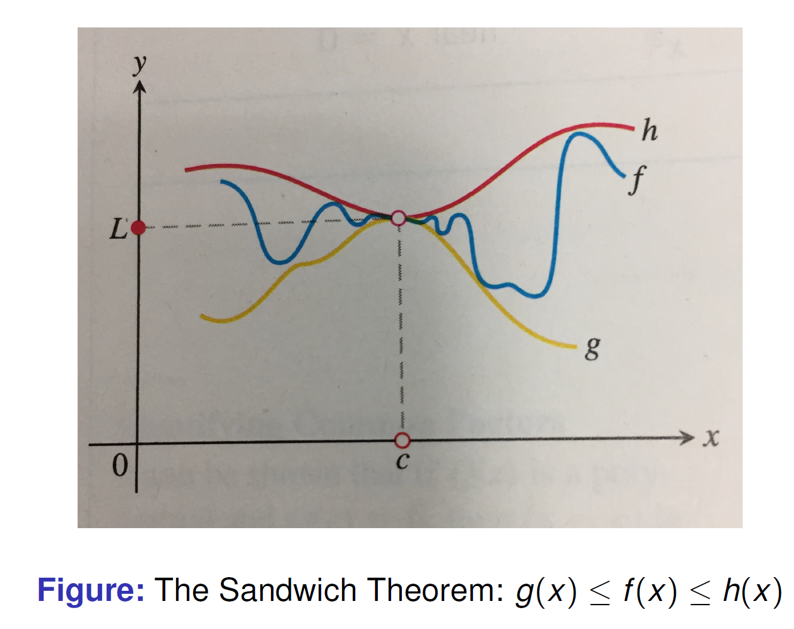
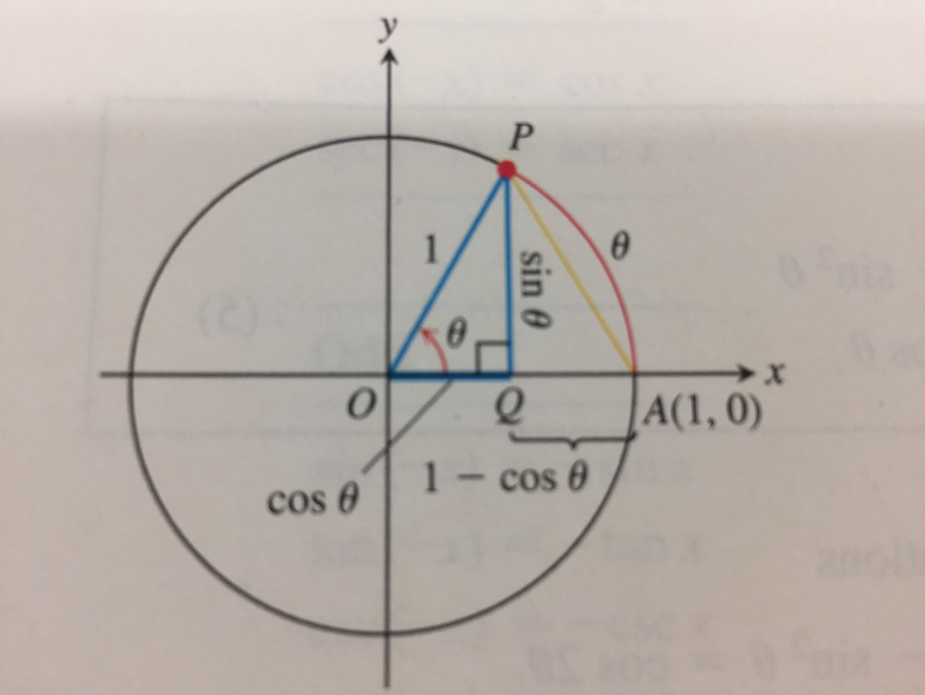
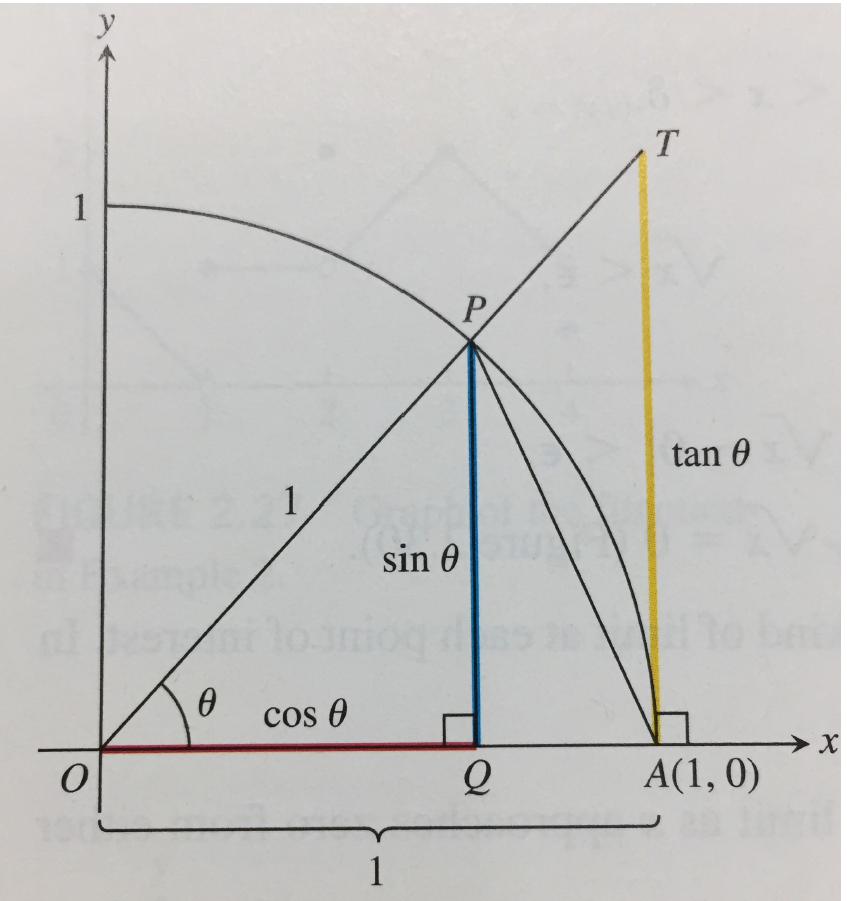
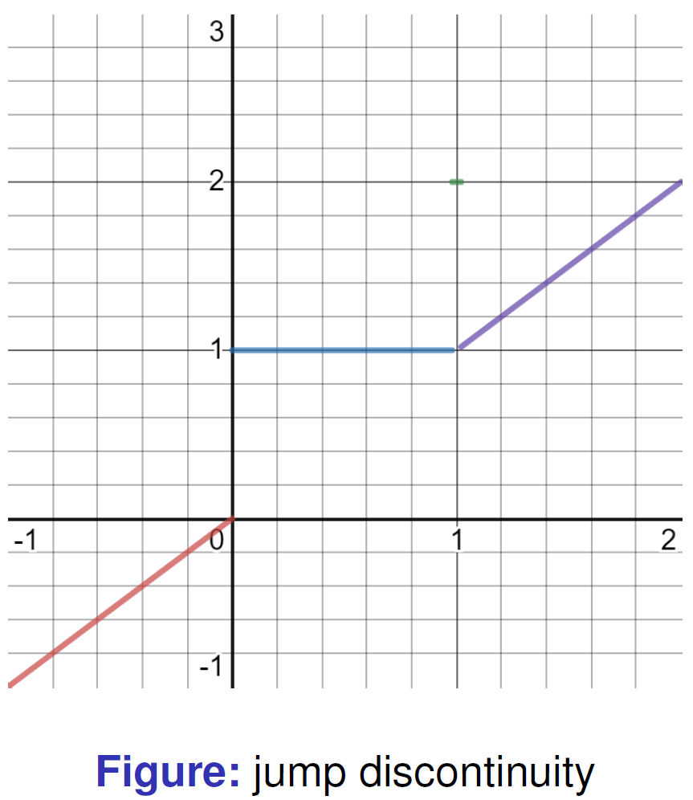

# Mathematical Analysis — Lecture 1
Class 1 2026.9.7
---
>class 5% homework 15% quizzes 20% midterm 20% final 40%

## Preliminary
>#### $\mathbb{N}$ denotes the set of all positive integers.
>#### $\mathbb{Z}$ denotes the set of all integers.
>#### $\mathbb{Q}$ denotes the set of all rational numbers.
>#### $\mathbb{R}$ denotes the set of all real numbers.

## Limits and Continuity

## 1. Key idea

>We use limits to describe the
tendency of a function as the variable
approaches a given point, but not the value at
the point.

## 2. Important examples

### Example 1: Same limit, different value at the point

$$
f(x)=
\begin{cases}
x^2\sin\dfrac1x,&x\ne0,\\
0,&x=0,
\end{cases}
$$

$$
g(x)=
\begin{cases}
x\sin\dfrac1x,&x\ne0,\\
1,&x=0.
\end{cases}
$$

Useful estimates:

$$
|f(x)|\le |x|^2,\qquad |g(x)|\le |x|.
$$

Therefore:

$$
\lim_{x\to0}f(x)=\underline{\hspace{2cm}},\qquad
\lim_{x\to0}g(x)=\underline{\hspace{2cm}}.
$$

My takeaway:

> If $x$ gets close to 0, keeping $x \ne 0$,
$f(x)$ approaches 0 with error $\leq |x|^2$ 
$g(x)$ approaches 0 with error $\leq |x|$

### Example 2: Average speed and instantaneous speed

Average speed:

$$
\frac{\Delta s}{\Delta t}
=\frac{f(t_2)-f(t_1)}{t_2-t_1}.
$$

With \(h=t_2-t_1\):

$$
\frac{f(t_1+h)-f(t_1)}{h}.
$$

Instantaneous speed at \(t_0\):

$$
v(t_0)=\lim_{h\to0}\frac{f(t_0+h)-f(t_0)}{h}
=\lim_{t\to t_0}\frac{f(t)-f(t_0)}{t-t_0}.
$$

##  Informal definition of limit
>Assume $f (x)$ is defined on an open interval
about $c$, except possibly at $c$ itself.
If $f (x)$ is arbitrarily close to $L$
for all $x$ sufficiently close to $c$ other than $c$
itself.
## 
$$\lim_{x\to{c}}f(x) = L$$
>is read “the limit of $f (x)$ as $x$ approaches $c$
is $L$.”

## 3. Limit calculation techniques

### Algebraic simplification

$$
\lim_{x\to1}\frac{x^2-1}{x-1}
=\lim_{x\to1}(x+1)
=\underline{\hspace{2cm}}.
$$

### Rationalizing the denominator

$$
\lim_{x\to1}\frac{\sqrt{x}-1}{x-1}
=\lim_{x\to1}\frac{1}{\sqrt{x}+1}
=\underline{\hspace{2cm}}.
$$

>Remark : simplification when calculating limits.

General strategy:

1. Check direct substitution.
2. Factor or rationalize if necessary.
3. Simplify, then evaluate the limit.

---

Class 2 2026.9.9
### Describe behaviour of function as $x \to 0  $
>1:Jump
>
>2:Unbounded
>
>3:Oscillation
>
## 4. When a limit does not exist

| Type        | What happens near the point?                   | Example              |
| ----------- | ---------------------------------------------- | -------------------- |
| Jump        | Left and right sides approach different values | Unit step function   |
| Unbounded   | Function values grow without bound             | \(1/x\) near 0       |
| Oscillation | Values do not approach one fixed number        | \(\sin(1/x)\) near . |

#
- A few words
    I will take notes in class every time, and I will post them to my personal website. The notes will include the main points of the lecture, and I will try to make them as clear as possible. However, I will not be able to include all the details, so please make sure to attend the lectures. Also, I will not be writing down every single the example, so please make sure to read the textbook and do the exercises.

---
# Lecture 2
## Definition of limit (Informal)
$$
g(x)=
\begin{cases}
2x &if~ x\ne4\\   
0  &if~ x=4  
\end{cases}
$$
By informal description of limit: “if $x$ gets sufficiently close to $4$, but not equal to $4$, then $g(x)$ gets arbitrarily close to $8$".
Need to show: “the gap between $g(x)$ and the number $L = 8$, i.e. $|g(x)-8|$ ，can be made as small as we choose, if $x$ is kept close enough to $c = 4$, but not equal to $4$."

## Definition
#####    Let $f (x)$ be defined on an open interval $I$ about $c$, except possibly at $c$ itself. We say that the limit of $f (x)$ as $x$ approaches $c$ is the number $L$, and write $~~~\displaystyle\lim_{x\to{c}} f(x) =  L ~$ if, for every number $\epsilon$ > 0, there exists a corresponding number $\delta$ > 0 such that $$ |f(x)-L|<\varepsilon \quad \text{whenever } x\in I \text{ and } 0<|x-c|<\delta. $$

## Simpler writing

We say $\lim_{x\to c} f(x)=L$ if for any $\varepsilon>0$, there exists $\delta>0$ such that

$$
\text{if } x\in I,\quad 0<|x-c|<\delta,\quad \text{then } |f(x)-L|<\varepsilon.
$$

#
  ##### Followings are in personal languages

- $\varepsilon$: how close we require $f(x)$ to be to $L$.
- $\delta$: how close $x$ needs to be to $c$ in order to satisfy that requirement.
- $|f(x)-L|<\varepsilon$: $f(x)$ lies within an $\varepsilon$-neighborhood of $L$.
- $0<|x-c|<\delta$: $x$ lies within a $\delta$-neighborhood of $c$, but $x\neq c$.

The key idea is:

$$
\boxed{
\text{Given any }\varepsilon>0,
\text{ we can find a }\delta>0
}
$$

such that

$$
x\text{ is sufficiently close to }c
\quad\Longrightarrow\quad
f(x)\text{ is within }\varepsilon\text{ of }L.
$$

In other words:

> **$\varepsilon$ is the required accuracy for the output, while $\delta$ is how much accuracy we need for the input.**

So the $\varepsilon$-$\delta$ definition gives a precise mathematical meaning to the intuitive statement:

> **If $x$ is sufficiently close to $c$, then $f(x)$ is sufficiently close to $L$.**

- ### Remark 1.1.2

>We shall use often the following arguments:
**(i)** Let $a$ be a real number. If for any $\varepsilon>0$ we have
$$
a\leq\varepsilon,
$$
then
$$
a\leq0.
$$
**(ii)** Let $a$ be a real number. If for any $\varepsilon>0$ we have
$$
-\varepsilon\leq a\leq\varepsilon,
$$
then
$$
a=0.
$$

## Example 1.1.6 revisited.

$$
g(x)=
\begin{cases}
2x, & \text{if } x\neq 4,\\
0, & \text{if } x=4.
\end{cases}
$$

Show
$$
\lim_{x\to 4}g(x)=8.
$$

**Analysis.** $\forall\varepsilon>0$, we need

$$
|g(x)-8|=|2x-8|<\varepsilon,
\qquad x\neq 4,
$$

which requires

$$
0<|x-4|<\frac{\varepsilon}{2}.
$$

**Proof.** Given arbitrary $\varepsilon>0$, take
$$
\delta=\frac{\varepsilon}{2}.
$$

Then we have:
$$
|g(x)-8|<\varepsilon
\quad\text{whenever}\quad
0<|x-4|<\delta.
$$

By the definition of limit, we have
$$
\lim_{x\to4}g(x)=8.
$$

### Excercise 1.1.8
##### (if you are reviewing, do it by youself)
$$ \displaystyle\lim_{x\to{1}}\frac{1}{x} = 1 $$
- Tips: make a restriction $x > \frac{1}{2}$，then $\epsilon|x| > \frac{\epsilon}{2}$.

### Excercise 1.1.5 revisited
**Using the definition of limit, prove the following functions have no limit as $x\to0$.**

### (a)

$$
U(x)=
\begin{cases}
0, & x<0,\\
1, & x\geq 0.
\end{cases}
$$

### (b)

$$
g(x)=
\begin{cases}
\dfrac{1}{x}, & x\neq 0,\\
0, & x=0.
\end{cases}
$$

### (c)

$$
f(x)=
\begin{cases}
0, & x\leq 0,\\
\sin\dfrac{1}{x}, & x>0.
\end{cases}
$$

###### Tips: Supppose the limit exists, then shows the contradiction.

##### for (b)
> Suppose $\displaystyle\lim_{x\to{0}}\frac{1}{x}=L$
> by Def...For $\epsilon_0=1$     
---
# Lecture 3
###### 2026.9.10

## Theorem 1.1.3 (Limit Laws)

Assume that
$$
\lim_{x\to c}f(x)=L
\qquad\text{and}\qquad
\lim_{x\to c}g(x)=M.
$$

### (a) Sum Rule

$$
\lim_{x\to c}\bigl(f(x)+g(x)\bigr)
=\lim_{x\to c}f(x)+\lim_{x\to c}g(x).
$$

### (b) Product Rule

$$
\lim_{x\to c}\bigl(f(x)\cdot g(x)\bigr)
=\lim_{x\to c}f(x)\cdot\lim_{x\to c}g(x).
$$

### (c) Quotient Rule

If $M\neq0$, then

$$
\lim_{x\to c}\frac{f(x)}{g(x)}
=\frac{\displaystyle\lim_{x\to c}f(x)}
{\displaystyle\lim_{x\to c}g(x)}.
$$

## Remark：
The Sum Rule states that:

\[
\lim_{x\to c}(f(x)+g(x))
=
\lim_{x\to c}f(x)+\lim_{x\to c}g(x)
\]

provided that both

\[
\lim_{x\to c}f(x)
\quad\text{and}\quad
\lim_{x\to c}g(x)
\]

exist.

### Does the Converse Hold?

In general, **no**.

That is,

\[
\lim_{x\to c}(f(x)+g(x))\text{ exists}
\]

does **not** imply that

\[
\lim_{x\to c}f(x)
\quad\text{and}\quad
\lim_{x\to c}g(x)
\]

both exist.

### Counterexample

Let

\[
f(x)=\sin\frac{1}{x},
\qquad
g(x)=-\sin\frac{1}{x}.
\]

Consider \(x\to0\).

Although

\[
\lim_{x\to0}\sin\frac{1}{x}
\]

does not exist, we have

\[
f(x)+g(x)
=
\sin\frac{1}{x}-\sin\frac{1}{x}
=
0.
\]

Therefore,

\[
\lim_{x\to0}(f(x)+g(x))
=
\lim_{x\to0}0
=
0
\]

exists.

Hence,

\[
\boxed{
\lim(f+g)\text{ exists}
\not\Longrightarrow
\lim f,\lim g\text{ both exist}
}
\]

Two functions may each fail to have a limit, but their problematic behavior can **cancel each other out**, causing their sum to have a limit.

Therefore:

\[
\boxed{
\lim f,\lim g\text{ both exist}
\Longrightarrow
\lim(f+g)=\lim f+\lim g
}
\]

but the converse is **not true in general**.

## Exercise 1.1.9 (Limits of Polynomials)

If

$$
P(x)=\sum_{k=0}^{n}a_kx^k
=a_nx^n+a_{n-1}x^{n-1}+\cdots+a_0,
$$

then

$$
\lim_{x\to c}P(x)
=\sum_{k=0}^{n}a_kc^k
=P(c).
$$

## Exercise 1.1.10 (Limits of Rational Functions)

If $P(x)$ and $Q(x)$ are polynomials and $Q(c)\neq0$, then

$$
\lim_{x\to c}\frac{P(x)}{Q(x)}
=\frac{P(c)}{Q(c)}.
$$

## Theorem 1.1.4 (The Sandwich Theorem)

Suppose that

$$
g(x)\leq f(x)\leq h(x)
$$

for all $x$ in some open interval containing $c$, except possibly at
$x=c$ itself. Suppose also that

$$
\lim_{x\to c}g(x)=\lim_{x\to c}h(x)=L.
$$

Then

$$
\lim_{x\to c}f(x)=L.
$$

## Exercise 1.1.12

Assume $I$ is an open interval, $c\in I$, and

$$
f(x)\leq b
\qquad\text{for all }x\in I\setminus\{c\}.
$$

Then

$$
\lim_{x\to c}f(x)\leq b,
$$

provided the limit exists.
>(do it yourself)

## Exercise 1.1.13 (Order-preserving Property of Limits)

If

$$
f(x)\leq g(x)
$$

for all $x$ in some open interval containing $c$, except possibly at
$x=c$, and the limits of $f$ and $g$ both exist as $x$ approaches $c$,
then

$$
\lim_{x\to c}f(x)
\leq
\lim_{x\to c}g(x).
$$

### Explanation

Limits preserve the non-strict inequality $\leq$, but may not preserve the
strict inequality $<$.

### Example

Let

$$
f(x)=x^2,
\qquad
g(x)=2x^2.
$$

For $x\neq0$, we have the strict inequality

$$
f(x)<g(x).
$$

However,

$$
\lim_{x\to0}x^2
=\lim_{x\to0}2x^2
=0.
$$

## Lemma 1.1.5

For $\theta$ measured in radians,

$$
-|\theta|\leq\sin\theta\leq|\theta|,
\qquad
-|\theta|\leq1-\cos\theta\leq|\theta|.
$$

In particular, for $0<\theta\leq\dfrac{\pi}{2}$,

$$
0<\sin\theta<\theta.
$$

## One-sided Limits

### Left-hand limit

We say that

$$
\lim_{x\to c^-}f(x)=L
$$

if, for every $\varepsilon>0$, there exists $\delta>0$ such that

$$
c-\delta<x<c
\quad\Longrightarrow\quad
|f(x)-L|<\varepsilon.
$$

In other words, $f(x)$ approaches $L$ as $x$ approaches $c$ from the left.

### Right-hand limit

We say that

$$
\lim_{x\to c^+}f(x)=L
$$

if, for every $\varepsilon>0$, there exists $\delta>0$ such that

$$
c<x<c+\delta
\quad\Longrightarrow\quad
|f(x)-L|<\varepsilon.
$$

In other words, $f(x)$ approaches $L$ as $x$ approaches $c$ from the right.

### Relation with the two-sided limit

The two-sided limit exists if and only if the left-hand and right-hand limits
both exist and are equal:

$$
\lim_{x\to c}f(x)=L
\quad\Longleftrightarrow\quad
\lim_{x\to c^-}f(x)=
\lim_{x\to c^+}f(x)=L.
$$

### Examples at $x\to0$

#### Example 1: The $0$-$1$ step function

Let

$$
U(x)=
\begin{cases}
0, & x<0,\\
1, & x\geq0.
\end{cases}
$$

Then

$$
\lim_{x\to0^-}U(x)=0,
\qquad
\lim_{x\to0^+}U(x)=1.
$$

Since the two one-sided limits are different,

$$
\lim_{x\to0}U(x)\text{ does not exist}.
$$

#### Example 2: The function $1/x$

Let

$$
f(x)=\frac{1}{x},
\qquad x\neq0.
$$

As $x$ approaches $0$ from the left, $1/x$ decreases without bound; as
$x$ approaches $0$ from the right, $1/x$ increases without bound:

$$
\lim_{x\to0^-}\frac{1}{x}=-\infty,
\qquad
\lim_{x\to0^+}\frac{1}{x}=+\infty.
$$

Therefore, $1/x$ has no finite two-sided limit at $0$.

#### Example 3: The oscillating function $\sin(1/x)$

Let

$$
g(x)=\sin\frac{1}{x},
\qquad x\neq0.
$$

When $x\to0^-$ or $x\to0^+$, the quantity $1/x$ becomes unbounded and
$\sin(1/x)$ keeps oscillating between $-1$ and $1$. Thus

$$
\lim_{x\to0^-}\sin\frac{1}{x}
\quad\text{and}\quad
\lim_{x\to0^+}\sin\frac{1}{x}
$$

both do not exist.

#### Preliminary: The density of $\mathbb{Q}$ in $\mathbb{R}$

We say that $\mathbb{Q}$ is dense in $\mathbb{R}$ if every non-empty open
interval in $\mathbb{R}$ contains a rational number. That is, for any
$a,b\in\mathbb{R}$ with $a<b$, there exists $q\in\mathbb{Q}$ such that

$$
a<q<b.
$$

Equivalently, for every $x\in\mathbb{R}$ and every $\varepsilon>0$, there
exists $q\in\mathbb{Q}$ such that

$$
|q-x|<\varepsilon.
$$

In fact, the irrational numbers are also dense in $\mathbb{R}$. Therefore,
every neighborhood of any real number contains both rational and irrational
numbers. This explains why the Dirichlet function takes both values $0$ and
$1$ arbitrarily close to every point.

#### Example 4: The Dirichlet function

Define the Dirichlet function by

$$
D(x)=
\begin{cases}
1, & x\in\mathbb{Q},\\
0, & x\in\mathbb{R}\setminus\mathbb{Q}.
\end{cases}
$$

Every interval to the left or right of $0$ contains both rational and
irrational numbers. Therefore, $D(x)$ takes the values $1$ and $0$ arbitrarily
close to $0$ from either side. Hence,

$$
\lim_{x\to0^-}D(x)
\quad\text{and}\quad
\lim_{x\to0^+}D(x)
$$

both do not exist.

## Theorem 1.1.6

Suppose that $f(x)$ is defined on an open interval containing $c$, except
possibly at $c$ itself. Then $f(x)$ has a limit as $x$ approaches $c$ if and
only if:

1. The left-hand limit and the right-hand limit both exist; and
2. These one-sided limits are equal.

More precisely,

$$
\lim_{x\to c}f(x)=L
\quad\Longleftrightarrow\quad
\lim_{x\to c^-}f(x)=
\lim_{x\to c^+}f(x)=L.
$$

### Proof

#### $(\Longrightarrow)$

Suppose that

$$
\lim_{x\to c}f(x)=L.
$$

Given any $\varepsilon>0$, there exists $\delta>0$ such that

$$
0<|x-c|<\delta
\quad\Longrightarrow\quad
|f(x)-L|<\varepsilon.
$$

If $c-\delta<x<c$, then $0<|x-c|<\delta$, so

$$
|f(x)-L|<\varepsilon.
$$

Thus,

$$
\lim_{x\to c^-}f(x)=L.
$$

Similarly, if $c<x<c+\delta$, then $0<|x-c|<\delta$, which gives

$$
\lim_{x\to c^+}f(x)=L.
$$

Therefore, both one-sided limits exist and are equal to $L$.

#### $(\Longleftarrow)$

Suppose that

$$
\lim_{x\to c^-}f(x)=L
\qquad\text{and}\qquad
\lim_{x\to c^+}f(x)=L.
$$

Given any $\varepsilon>0$, there exist $\delta_1>0$ and $\delta_2>0$ such
that

$$
c-\delta_1<x<c
\quad\Longrightarrow\quad
|f(x)-L|<\varepsilon,
$$

and

$$
c<x<c+\delta_2
\quad\Longrightarrow\quad
|f(x)-L|<\varepsilon.
$$

Choose

$$
\delta=\min\{\delta_1,\delta_2\}.
$$

If $0<|x-c|<\delta$, then either $c-\delta<x<c$ or
$c<x<c+\delta$. In either case,

$$
|f(x)-L|<\varepsilon.
$$

Therefore, by the $\varepsilon$-$\delta$ definition of a limit,

$$
\lim_{x\to c}f(x)=L.
$$

## Theorem 1.1.7

For $\theta$ measured in radians,

$$
\lim_{\theta\to0}\frac{\sin\theta}{\theta}=1.
$$

### Proof

For $0<\theta<\dfrac{\pi}{2}$, the standard trigonometric inequalities give

$$
\cos\theta
\leq
\frac{\sin\theta}{\theta}
\leq1.
$$

Since

$$
0\leq1-\cos\theta\leq\theta,
$$

we have

$$
\lim_{\theta\to0}\cos\theta=1.
$$

Therefore, by the Sandwich Theorem,

$$
\lim_{\theta\to0^+}\frac{\sin\theta}{\theta}=1.
$$

For $\theta<0$, using $\sin(-\theta)=-\sin\theta$ gives

$$
\frac{\sin\theta}{\theta}
=\frac{\sin(-\theta)}{-\theta}.
$$

Thus, the left-hand limit is also $1$. Hence,

$$
\boxed{\displaystyle\lim_{\theta\to0}\frac{\sin\theta}{\theta}=1}.
$$

### Consequences

For any constant $k\neq0$,

$$
\lim_{\theta\to0}\frac{\sin(k\theta)}{\theta}
=k\lim_{\theta\to0}\frac{\sin(k\theta)}{k\theta}
=k.
$$

Also,

$$
\lim_{x\to0}\frac{\sin(\sin x)}{\sin x}=1,
$$

and, more generally, if the sine function is composed with itself $n$ times,

$$
\lim_{x\to0}
\frac{\sin\bigl(\sin(\cdots\sin x\cdots)\bigr)}{x}=1
\qquad\text{($n$ folds)}.
$$

### $\displaystyle\lim_{x\to{0}}\frac{sin(sin(x))}{x}$

Since

$$
\lim_{x\to0}\sin x=0,
$$

we can apply Theorem 1.1.7 with $\theta=\sin x$. Therefore,

$$
\lim_{x\to0}\frac{\sin(\sin x)}{\sin x}=1.
$$

Using the product rule, we write

$$
\frac{\sin(\sin x)}{x}
=\frac{\sin(\sin x)}{\sin x}\cdot\frac{\sin x}{x}.
$$

Hence,

$$
\begin{aligned}
\lim_{x\to0}\frac{\sin(\sin x)}{x}
&=\left(\lim_{x\to0}\frac{\sin(\sin x)}{\sin x}\right)
\left(\lim_{x\to0}\frac{\sin x}{x}\right)\\
&=1\cdot1\\
&=1.
\end{aligned}
$$

---
# Lecture 4

## Example 1.1.19

$$
f(x)=
\begin{cases}
x, & x<0,\\
1, & 0\leq x<1,\\
2, & x=1,\\
x, & x>1.
\end{cases}
$$

## Definition 1.1.8 (Continuity at a Point)

Let $c$ be a real number that is either an interior point (case (a)) or an
endpoint (case (b) or (c)) of an interval in the domain of $f$.

### (a) Interior point

$f$ is continuous at $c$ if

$$
\lim_{x\to c}f(x)=f(c).
$$

### (b) Right-continuity

$f$ is right-continuous at $c$ (or continuous from the right) if

$$
\lim_{x\to c^+}f(x)=f(c).
$$

### (c) Left-continuity

$f$ is left-continuous at $c$ (or continuous from the left) if

$$
\lim_{x\to c^-}f(x)=f(c).
$$

